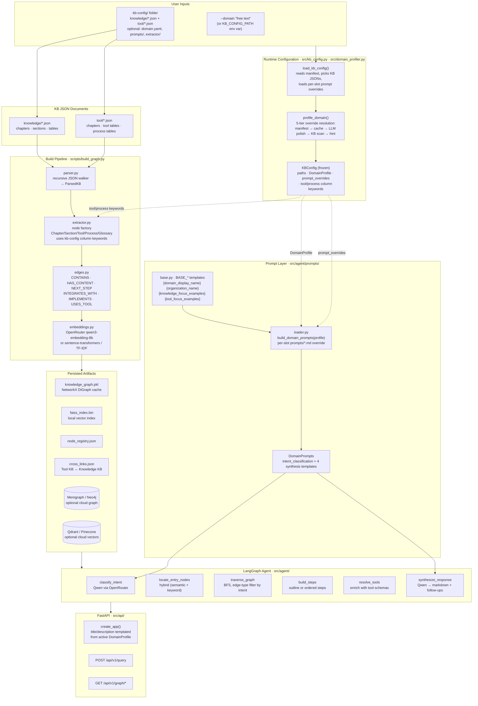
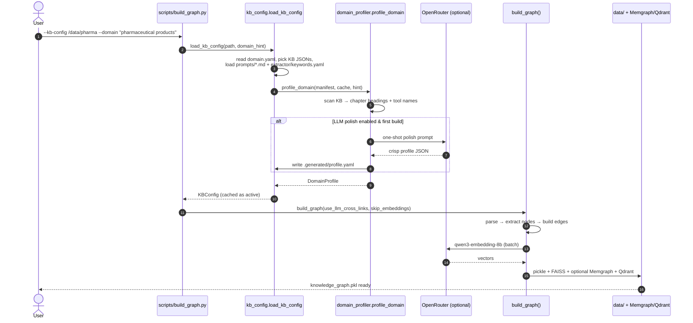
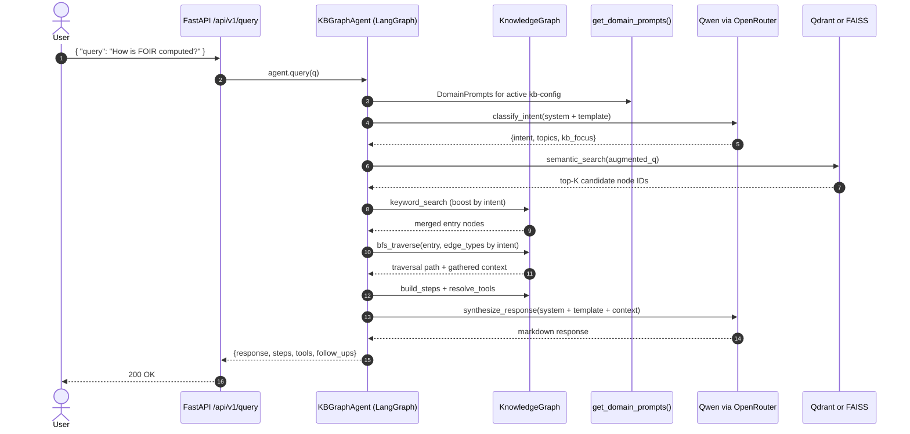
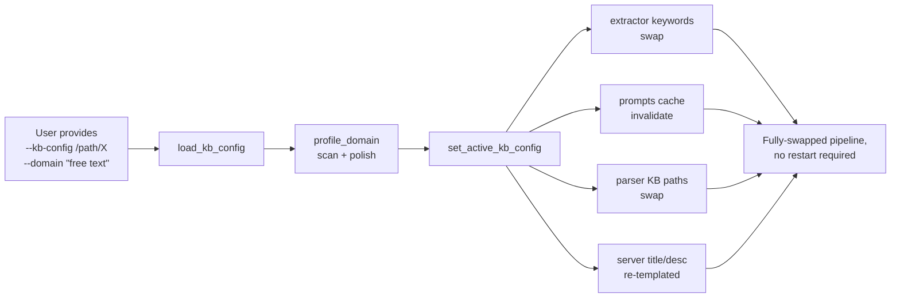
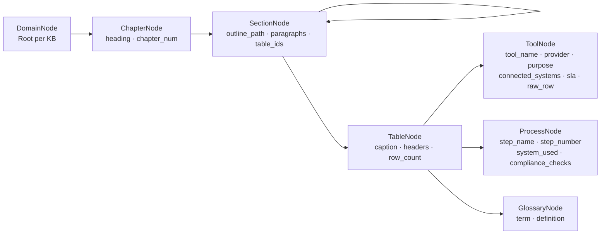
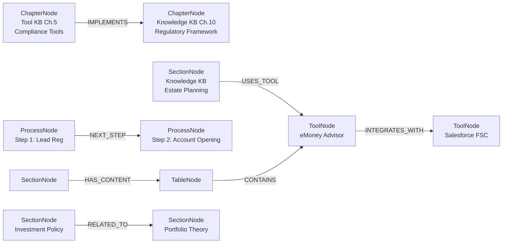
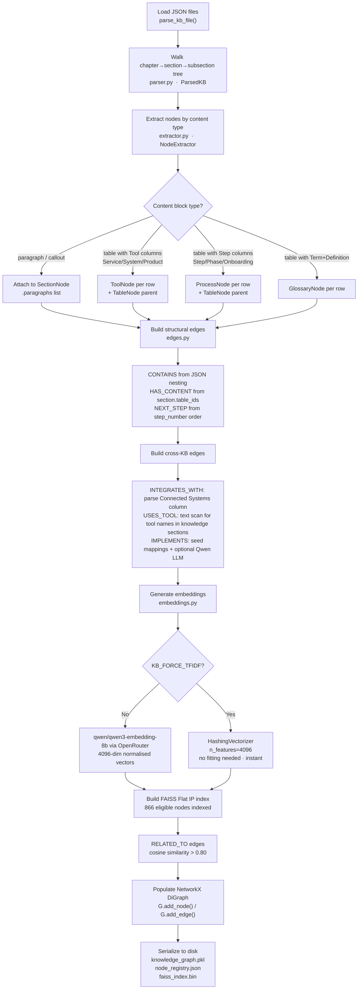
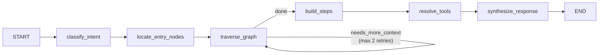
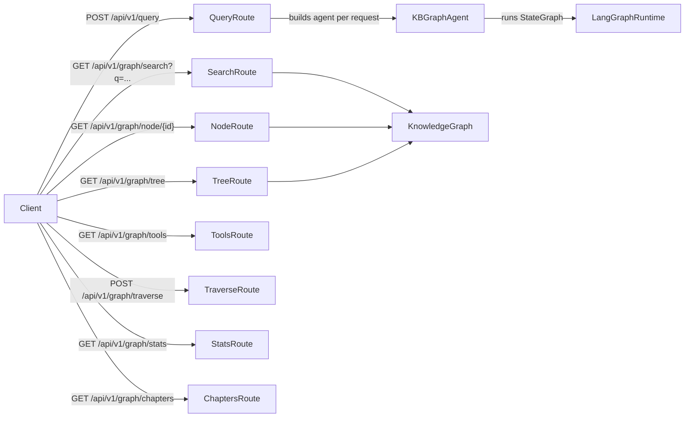

# Loan Knowledge Graph Engine

A production-grade, tree-based knowledge graph engine for loan underwriting and eligibility assessment. Parses structured knowledge bases — loan policy manuals and technology stacks — into a typed graph, then exposes a LangGraph + Qwen-powered agent that navigates the graph to deliver step-by-step responses with tool schemas, process workflows, and related concepts.

---

## Table of Contents

1. [High-Level Architecture](#1-high-level-architecture)
2. [Data Sources](#2-data-sources)
3. [Graph Data Model](#3-graph-data-model)
4. [Ingestion Pipeline](#4-ingestion-pipeline)
5. [LangGraph Agent](#5-langgraph-agent)
6. [Embedding & Search](#6-embedding--search)
7. [API Layer](#7-api-layer)
8. [Cross-KB Linking](#8-cross-kb-linking)
9. [Project Structure](#9-project-structure)
10. [Graph Statistics](#10-graph-statistics)
11. [Quick Start](#11-quick-start)
12. [API Reference](#12-api-reference)
13. [Intent Types & Query Examples](#13-intent-types--query-examples)
14. [Configuration](#14-configuration)
15. [Cloud Infrastructure](#15-cloud-infrastructure)

---

## 1. High-Level Architecture

The engine is **domain-agnostic**. A user points `--kb-config` at any self-describing folder (with `knowledge/*.json` + `tool/*.json` inside), names a domain in free text with `--domain`, and the pipeline auto-builds a knowledge graph and LLM-ready agent — no code changes per domain (works for loan underwriting, wealth management, pharma, automotive, medical records, education, etc.).

### 1.1 End-to-End Architecture



### 1.2 Build-Time Sequence



### 1.3 Query-Time Sequence



### 1.4 Domain-Switching Flow

Switching domains at runtime requires **zero code changes** — only the active `KBConfig` changes. All domain-specific state (profile fields, prompt templates, column-keyword sets, KB paths) routes through `get_active_kb_config()`, which other modules call lazily.



**What stays the same when you switch domains:** BASE_* prompt templates, extractor logic, edge-builder logic, agent StateGraph, FastAPI routes, storage backends.

**What changes automatically:** `domain_display_name`, `organization_name`, `knowledge_focus_examples`, `tool_focus_examples` (all injected into prompts); per-slot `prompts/*.md` overrides; per-kb extractor column keywords; KB file paths; server title/description.

---

## 2. Data Sources

Both source files share the same parsed-document JSON schema produced by the KB parser pipeline:

```
{
  "title": "...",
  "subtitle": "...",
  "metadata": { "total_chapters": N, "total_tables": M, ... },
  "chapters": [
    {
      "heading": "Chapter N: ...",
      "level": 1,
      "content": [ { "type": "paragraph|table|list_bullet|callout", ... } ],
      "sections": [
        {
          "heading": "N.M ...",
          "level": 2,
          "content": [...],
          "subsections": [ ... ]   ← recursive, unlimited depth
        }
      ]
    }
  ]
}
```

| File | Domain | Chapters | Tables | Size |
|------|--------|----------|--------|------|
| `Loan_Eligibility_Knowledge_Base.json` | Loan policy: applicant classification, age eligibility, residency/KYC, income assessment (salaried/self-employed), and documentation requirements | 19 | 15 | ~97 KB |
| `Loan_Assessment_Tools_KB.json` | Technology stack: credit bureaus, KYC/fraud systems, income analyzers, LOS/Decisioning engines, and collections platforms | 5 | 5 | ~16 KB |

There are **no explicit cross-references** between the two files. All relationships are either hierarchical (JSON nesting) or inferred semantically.

---

## 3. Graph Data Model

### 3.1 Node Types



| Node Type | Source | Count | Key Fields |
|-----------|--------|-------|------------|
| `DomainNode` | Derived | 2 | heading, kb_source |
| `ChapterNode` | Both KBs | 24 | heading, chapter_num, level |
| `SectionNode` | Both KBs | 40 | heading, outline_path, paragraphs, table_ids |
| `TableNode` | Both KBs | 15 | caption, headers, row_count |
| `ToolNode` | Tool KB tables | 18 | tool_name, provider, purpose, connected_systems, sla, raw_row |
| `ProcessNode` | Process tables | 0 | step_name, step_number, system_used, required_actions, compliance_checks |
| `GlossaryNode` | Knowledge KB | 0 | term, definition |

**Node ID convention:**
```
knowledge:root                                      ← DomainNode
knowledge:ch3                                       ← ChapterNode
knowledge:ch3:s3.2-3-2-capital-market-theory        ← SectionNode
knowledge:ch3:s3.2-3-2-capital-market-theory:tbl0   ← TableNode
tool:ch10:s10.3-digital-onboarding-workflow:tbl0:step2  ← ProcessNode
knowledge:glossary:fiduciary                        ← GlossaryNode
```

### 3.2 Edge Types



| Edge Type | Direction | Source | Count | Meaning |
|-----------|-----------|--------|-------|---------|
| `CONTAINS` | parent → child | JSON nesting | 82 | Hierarchical ownership (chapter owns section, table owns row) |
| `USES_TOOL` | knowledge section → tool | Name mention in text | 19 | A knowledge KB section's text mentions a tool by name |
| `HAS_CONTENT` | section → table | Section.table_ids | 15 | Section directly contains a table |
| `NEXT_STEP` | step N → step N+1 | Process tables | 0 | Sequential workflow ordering |
| `INTEGRATES_WITH` | tool → tool | "Connected Systems" column | 15 | Tool integration topology |
| `IMPLEMENTS` | tool chapter → knowledge chapter | Seed + LLM mapping | 0 | Tool KB domain implements a knowledge domain |
| `RELATED_TO` | node ↔ node | FAISS cosine > 0.80 | 0 | Semantic similarity |

---

## 4. Ingestion Pipeline

The build pipeline runs once and persists all artifacts to `data/`. Subsequent API starts load from disk in ~2 seconds.



**Column detection heuristics** used by `extractor.py`:

| Detection Target | Matched Column Keywords |
|-----------------|------------------------|
| ToolNode | `Tool`, `Service`, `System`, `Product`, `Application`, `Platform`, `Software`, `Vendor`, `Provider` |
| ProcessNode | `Step`, `Phase`, `Stage`, `Workflow`, `Onboarding Step`, `Process Step`, `Action`, `Task` |
| GlossaryNode | columns named exactly `Term` + `Definition` |

---

## 5. LangGraph Agent

The agent is a compiled `StateGraph` with six sequential nodes, one conditional re-traversal edge, and a typed shared state.

### 5.1 Agent Graph



### 5.2 Agent State

```python
class GraphAgentState(TypedDict):
    # Input
    query: str

    # After classify_intent
    intent: str                    # "explore" | "process" | "tool_lookup" | "compare"
    extracted_topics: list[str]    # key entities extracted by LLM
    kb_focus: str                  # "knowledge" | "tool" | "both"

    # After locate_entry_nodes
    entry_nodes: list[str]         # top-K node IDs from hybrid search

    # After traverse_graph
    traversal_path: list[str]      # BFS-ordered visited node IDs
    gathered_context: list[dict]   # content from each visited node

    # After build_steps
    steps: list[StepDetail]        # structured step-by-step data
    tools_referenced: list[dict]   # full ToolNode.to_dict() for each tool
    knowledge_concepts: list[dict] # glossary terms encountered

    # Final
    response: str                  # synthesized markdown
    follow_up_suggestions: list[str]
```

### 5.3 Node Descriptions

#### `classify_intent`
Calls Qwen with the raw query and a structured JSON prompt. Outputs `intent`, `extracted_topics`, and `kb_focus`. Falls back to keyword heuristics if the LLM fails.

```
Input:  query = "How do I onboard a new client at Meridian?"
Output: intent="process", kb_focus="tool",
        extracted_topics=["client onboarding", "Meridian system procedures"]
```

#### `locate_entry_nodes`
Runs **hybrid search**: 60% FAISS cosine similarity + 40% keyword token match, then applies intent-specific score boosts:

| Intent | Boosted Node Types |
|--------|--------------------|
| `process` | +0.25 for ProcessNode, +0.15 for SectionNode |
| `tool_lookup` | +0.20 for ToolNode |
| `explore` | +0.15 for ChapterNode, SectionNode |
| `compare` | no extra boost |

#### `traverse_graph`
BFS from entry nodes with intent-specific edge filters and depth limits:

| Intent | Edge Types Followed | Max Depth | Max Nodes |
|--------|--------------------|-----------|----|
| `process` | CONTAINS, HAS_CONTENT, NEXT_STEP, USES_TOOL | 4 | 50 |
| `tool_lookup` | CONTAINS, INTEGRATES_WITH, IMPLEMENTS | 3 | 40 |
| `compare` | CONTAINS, RELATED_TO, IMPLEMENTS | 3 | 40 |
| `explore` | CONTAINS, HAS_CONTENT, RELATED_TO | 3 | 35 |

#### `build_steps`
- **process intent**: collects all `ProcessNode`s in the traversal, sorts by `step_number`, links each step to its system via keyword search
- **other intents**: builds an outline from chapters and sections in traversal order

#### `resolve_tools`
For each entry node, follows `USES_TOOL` and `IMPLEMENTS` edges to collect `ToolNode`s. Enriches each step's `tools` field with full `raw_row` data (the original table row = the tool "schema").

#### `synthesize_response`
Calls Qwen with a template selected by intent. Each template produces structured markdown with overview, step-by-step guide, tool details, and follow-up suggestions.

---

## 6. Embedding & Search

### 6.1 Embedding Strategies

| Mode | Model | Dim | Speed | Quality |
|------|-------|-----|-------|---------|
| Default | `qwen/qwen3-embedding-8b` (OpenRouter API) | 4096 | ~60s build | SOTA multilingual, #1 MTEB |
| `KB_FORCE_TFIDF=1` | `HashingVectorizer` (sklearn) | 4096 | ~2s build | Keyword-level, fully offline |

866 of the 953 nodes are embedded (GlossaryNodes excluded to reduce noise).

### 6.2 Hybrid Search

```
hybrid_score(node) = 0.6 × FAISS_cosine_score + 0.4 × keyword_token_score
```

**Keyword scoring**: counts how many query tokens (length ≥ 4) appear in `heading + content_summary`, divided by total token count.

**FAISS index**: `IndexFlatIP` (inner product on L2-normalised vectors = cosine similarity). No approximate search — exact retrieval over 866 nodes is fast enough.

### 6.3 RELATED_TO Edge Generation

After indexing, each node queries its k+1 nearest neighbours. A `RELATED_TO` edge is added when:
- cosine similarity > 0.80
- source and target do not share the same `parent_id` (avoids trivial siblings)
- the pair has not already been connected

---

## 7. API Layer



The `KnowledgeGraph` singleton is loaded once at server startup via FastAPI's `lifespan` context. All read routes hit the in-memory NetworkX graph directly (no DB round-trips). The `POST /query` route instantiates a `KBGraphAgent` per request and invokes the compiled LangGraph.

---

## 8. Cross-KB Linking

The two KBs have no shared IDs. Cross-KB links are created in two layers:

### Layer 1 — USES_TOOL (text scan)
Every `SectionNode` in the **Knowledge KB** is scanned for tool names. If a tool name (≥5 chars) appears in the section's raw text, a `USES_TOOL` edge is added from that section to the `ToolNode`.

### Layer 2 — IMPLEMENTS (auto-generated chapter-level mapping)

Tool KB chapters are mapped to Knowledge KB chapters they implement via `src/graph_builder/cross_kb_mapper.py`. The mapping is **fully automatic** — no hardcoded seeds — and adapts whenever the KB JSON files change.

#### How auto-mapping works

Two complementary signals are combined and thresholded at build time:

**Signal 1 — Embedding similarity (weight 0.6)**
Each chapter's `heading + content_summary + raw_text[:500]` is embedded using the same model as the main pipeline (`qwen/qwen3-embedding-8b` via OpenRouter, or TF-IDF under `KB_FORCE_TFIDF=1`). Pairwise cosine similarity is computed between every Tool × Knowledge chapter pair.

**Signal 2 — Keyword co-occurrence (weight 0.4)**
For each Tool chapter, all `ToolNode.tool_name` values in its subtree are collected. For each Knowledge chapter, descendant `SectionNode` texts are concatenated. The fraction of tool names that appear in the Knowledge chapter text is computed and normalised to [0, 1]. This directly measures "which Knowledge chapters discuss the tools that live in this Tool chapter".

**Combined score**
```
score(tool_ch, know_ch) = 0.6 × cosine_sim + 0.4 × cooccur_norm
```

Pairs above `CROSS_KB_AUTO_THRESHOLD` (default 0.35) are kept, capped at `CROSS_KB_MAX_LINKS_PER_CHAPTER` (default 5) per Tool chapter. An optional LLM refinement pass (`_refine_with_llm`) can then augment the auto-generated set when `use_llm=True`.

#### Tuning knobs (in `config.py`)

| Constant | Default | Effect |
|---|---|---|
| `CROSS_KB_AUTO_THRESHOLD` | `0.35` | Raise to require stronger signal; lower to map more chapters |
| `CROSS_KB_EMBED_WEIGHT` | `0.6` | Weight for embedding cosine similarity |
| `CROSS_KB_COOCCUR_WEIGHT` | `0.4` | Weight for keyword co-occurrence |
| `CROSS_KB_MAX_LINKS_PER_CHAPTER` | `5` | Max Knowledge chapters per Tool chapter |

#### Caching

The generated mapping is written to `data/cross_links.json` on first build and reused on subsequent builds. Delete the file to force regeneration (e.g. after adding new chapters to either KB).

---

## 9. Project Structure

```
kb-index/
│
├── kb-config/                          ← source data (read-only)
│   ├── knowledge/
│   │   └── Wealth_Management_Knowledge_Base.json
│   └── tool/
│       └── Meridian_WM_Tools_Database_Document_KB.json
│
├── src/
│   ├── config.py                       ← all constants: paths, LLM, thresholds
│   │
│   ├── models/
│   │   ├── nodes.py                    ← Pydantic node models + Edge + enums
│   │   └── state.py                    ← LangGraph GraphAgentState TypedDict
│   │
│   ├── graph_builder/
│   │   ├── parser.py                   ← ParsedKB / ParsedChapter / ParsedSection / ContentBlock
│   │   ├── extractor.py                ← NodeExtractor  (node factory per KB)
│   │   ├── edges.py                    ← EdgeBuilder  (7 edge constructors)
│   │   ├── embeddings.py               ← EmbeddingPipeline + FAISS + _TFIDFEmbedder fallback
│   │   ├── cross_kb_mapper.py          ← auto-generate Tool→Knowledge chapter mappings
│   │   └── builder.py                  ← build_graph() + KnowledgeGraph runtime class
│   │
│   ├── agent/
│   │   ├── prompts.py                  ← LLM prompt templates (4 intent × 2 roles)
│   │   ├── nodes.py                    ← 6 agent node functions
│   │   └── graph.py                    ← build_agent_graph() + KBGraphAgent wrapper
│   │
│   └── api/
│       ├── routes.py                   ← 8 FastAPI route handlers
│       └── server.py                   ← FastAPI app + lifespan + CORS
│
├── scripts/
│   ├── build_graph.py                  ← Typer CLI: build / rebuild the graph
│   └── query_cli.py                    ← Typer CLI: query / search / stats / node inspect
│
├── data/                               ← generated artifacts (git-ignored)
│   ├── knowledge_graph.pkl             ← serialised NetworkX DiGraph
│   ├── node_registry.json              ← all node metadata as JSON
│   ├── faiss_index.bin                 ← FAISS flat inner-product index
│   ├── faiss_index.ids.pkl             ← ordered node_id list matching FAISS positions
│   ├── faiss_index.model_type.txt      ← "sentence_transformers" or "tfidf"
│   ├── faiss_index.tfidf.pkl           ← saved HashingVectorizer (if tfidf mode)
│   └── cross_links.json                ← Tool KB ↔ Knowledge KB chapter mappings
│
├── requirements.txt
└── README.md
```

---

## 10. Graph Statistics

| Metric | Count |
|--------|-------|
| **Total nodes** | **99** |
| **Total edges** | **131** |
| — domain | 2 |
| — chapter | 24 |
| — section | 40 |
| — table | 15 |
| — tool | 18 |
| — process step | 0 |
| — glossary | 0 |
| **CONTAINS** | 82 |
| **USES_TOOL** | 19 |
| **HAS_CONTENT** | 15 |
| **NEXT_STEP** | 0 |
| **INTEGRATES_WITH** | 15 |
| **IMPLEMENTS** | 0 |
| **RELATED_TO** | 0 |
| Build time (hash embeddings) | ~4s |
| Build time (qwen3-embedding-8b via OpenRouter) | ~30s |
| Graph load time from disk | ~1s |

---

## 11. Quick Start

### Step 1 — Install & configure

```bash
python3 -m venv .venv
source .venv/bin/activate
pip install -r requirements.txt

# Copy the example env file and add your OpenRouter API key
cp .env.example .env
# then edit .env and set OPENROUTER_API_KEY
```

### Step 2 — Build the graph

```bash
# Full build: qwen3-embedding-8b via OpenRouter + LLM cross-linking (needs network)
python3 scripts/build_graph.py

# Fast build: seed cross-links only, no LLM call
python3 scripts/build_graph.py --no-llm

# Offline build: hash embeddings, no network needed at all
KB_FORCE_TFIDF=1 python3 scripts/build_graph.py --no-llm

# Verbose output
KB_FORCE_TFIDF=1 python3 scripts/build_graph.py --no-llm --verbose
```

### Step 3 — Start the API server

```bash
# With OpenRouter embeddings (default)
python3 -m uvicorn src.api.server:app --port 8000 --reload

# Offline / hash embeddings
KB_FORCE_TFIDF=1 python3 -m uvicorn src.api.server:app --port 8000 --reload
```

Swagger UI: `http://localhost:8000/docs`

### Step 4 — Query via CLI

```bash
# Single query
KB_FORCE_TFIDF=1 python3 scripts/query_cli.py query \
  --query "What are the age eligibility rules for salaried applicants?"

# Interactive REPL
KB_FORCE_TFIDF=1 python3 scripts/query_cli.py query --interactive

# Graph stats
KB_FORCE_TFIDF=1 python3 scripts/query_cli.py stats

# Semantic/keyword search
KB_FORCE_TFIDF=1 python3 scripts/query_cli.py search "portfolio rebalancing"

# Inspect a node and its edges
KB_FORCE_TFIDF=1 python3 scripts/query_cli.py node "tool:ch2:s2.1-2-1-primary-crm-salesforce"
```

---

## 12. API Reference

### POST `/api/v1/query`

Main query endpoint. Runs the full LangGraph agent pipeline.

**Request:**
```json
{
  "query": "How do I onboard a new client at Meridian?"
}
```

**Response:**
```json
{
  "query": "How do I onboard a new client at Meridian?",
  "intent": "process",
  "kb_focus": "tool",
  "extracted_topics": ["client onboarding", "Meridian system procedures"],
  "response": "## Overview\nClient onboarding at Meridian...\n\n## Step-by-Step Guide\n...",
  "steps": [
    {
      "step_number": 1,
      "title": "Lead Registration",
      "description": "Capture client contact and financial details in Salesforce CRM...",
      "system_used": "Salesforce CRM",
      "time_to_complete": "5 minutes",
      "compliance_checks": "None (lead stage)",
      "tools": [ { "tool_name": "Salesforce Financial Services Cloud", ... } ]
    }
  ],
  "tools_referenced": [
    {
      "tool_name": "Salesforce Financial Services Cloud",
      "provider": "Salesforce",
      "purpose": "CRM: client management, pipeline, workflows, Einstein Analytics",
      "connected_systems": ["Orion Connect", "eMoney", "Tamarac"],
      "sla": "99.9%+",
      "raw_row": { "Service": "...", "Provider": "...", ... }
    }
  ],
  "knowledge_concepts": [],
  "follow_up_suggestions": [
    "What compliance checks are required in this process?",
    "How do the systems integrate in this workflow?",
    "What are the exception handling procedures for this process?"
  ],
  "traversal_path": ["tool:ch10:s10.3-...", "tool:ch2:s2.1-..."]
}
```

### GET `/api/v1/graph/stats`

Returns node and edge counts by type.

### GET `/api/v1/graph/tree?max_depth=2`

Returns the two root nodes (Knowledge KB root + Tool KB root) with subtrees. Used by a front-end tree navigator. `max_depth` controls how many levels are expanded (1–4).

### GET `/api/v1/graph/tools?search=CIBIL&provider=TransUnion&limit=50`

Lists all 18 extracted `ToolNode`s. Optional filters:
- `search`: substring match on tool_name or purpose
- `provider`: substring match on provider name
- `category`: substring match on category
- `limit`: max results (default 50, max 200)

### GET `/api/v1/graph/search?q=portfolio+management&top_k=10&node_type=section`

Hybrid semantic+keyword search. Optional `node_type` filter: `chapter`, `section`, `tool`, `process`, `glossary`, `table`.

### GET `/api/v1/graph/node/{node_id}`

Returns a node's full data plus its incoming and outgoing edges.

### POST `/api/v1/graph/traverse`

BFS from a starting node with optional edge-type filter.

```json
{
  "node_id": "tool:ch10:s10.3-digital-onboarding-workflow",
  "max_depth": 3,
  "edge_types": ["CONTAINS", "NEXT_STEP"]
}
```

### GET `/api/v1/graph/chapters`

Lists all 42 `ChapterNode`s from both KBs sorted by source and chapter number.

---

## 13. Intent Types & Query Examples

| Intent | When Used | Edge Priority | Example Queries |
|--------|-----------|---------------|-----------------|
| `process` | Step-by-step workflows, procedures | NEXT_STEP → CONTAINS → USES_TOOL | "How do I onboard a new client?" · "What are the steps for account opening?" · "Walk me through the trade execution workflow" |
| `explore` | Understanding concepts, domains | CONTAINS → HAS_CONTENT → RELATED_TO | "What is wealth management?" · "Explain tax-loss harvesting" · "What is the fiduciary standard?" |
| `tool_lookup` | Finding specific tools/systems | CONTAINS → INTEGRATES_WITH → IMPLEMENTS | "What CRM does Meridian use?" · "What tools support compliance surveillance?" · "Which systems handle trading?" |
| `compare` | Comparing options or strategies | CONTAINS → RELATED_TO → IMPLEMENTS | "Orion vs Tamarac for portfolio management" · "Active vs passive investing" · "SMA vs UMA structures" |

---

## 14. Configuration

### `.env` file

Sensitive values live in `.env` at the project root (gitignored). Copy `.env.example` to get started:

```bash
cp .env.example .env
```

#### OpenRouter (required)

| Variable | Required | Description |
|----------|----------|-------------|
| `OPENROUTER_API_KEY` | **Yes** | Your OpenRouter API key |
| `OPENROUTER_BASE_URL` | No | Defaults to `https://openrouter.ai/api/v1` |
| `LLM_MODEL` | No | Defaults to `qwen/qwen3-235b-a22b` |
| `LLM_TEMPERATURE` | No | Defaults to `0.1` |
| `LLM_MAX_TOKENS` | No | Defaults to `4096` |

#### Cloud Infrastructure (optional — local fallback if omitted)

| Variable | Description | Local Fallback |
|----------|-------------|----------------|
| `PINECONE_API_KEY` | Pinecone API key | Local FAISS index |
| `PINECONE_INDEX_NAME` | Pinecone index name (default: `kb-index`) | — |
| `PINECONE_NAMESPACE` | Namespace / "folder" inside the index (default: `kb-knowledge-graph`) | — |
| `NEO4J_URI` | Neo4j Aura bolt URI (`neo4j+s://...`) | NetworkX pickle |
| `NEO4J_USERNAME` | Neo4j username | — |
| `NEO4J_PASSWORD` | Neo4j password | — |
| `NEO4J_DATABASE` | Neo4j database name (default: `neo4j`) | — |
| `BLOB_READ_WRITE_TOKEN` | Vercel Blob read-write token | Local `kb-config/` files |
| `BLOB_STORE_PATH` | Blob prefix path (default: `v0-it-support-automation-blob/kb-config`) | — |

**Cloud-default, local-fallback**: each cloud service is automatically enabled when its credentials are present. All three can be mixed independently (e.g. Neo4j cloud + FAISS local).

### Shell / Environment Variables

| Variable | Values | Description |
|----------|--------|-------------|
| `KB_FORCE_TFIDF` | `1` / `0` | Force hash-based embeddings (no network, no PyTorch) |

### `src/config.py` Constants

| Constant | Default | Description |
|----------|---------|-------------|
| `LLM_MODEL` | `qwen/qwen3-235b-a22b` | OpenRouter model ID |
| `EMBEDDING_MODEL` | `qwen/qwen3-embedding-8b` | Embedding model — remote (contains "/") uses OpenRouter API; local name uses sentence-transformers |
| `EMBEDDING_DIM` | `4096` | TF-IDF fallback dimension (real FAISS dim comes from model output) |
| `EMBEDDING_DIMENSIONS` | _(unset)_ | Matryoshka override (32–4096); unset = model native 4096 |
| `SIMILARITY_THRESHOLD` | `0.80` | Min cosine score for RELATED_TO edges |
| `MAX_RELATED_EDGES_PER_NODE` | `8` | Max fan-out from semantic edges |
| `MAX_TRAVERSAL_DEPTH` | `5` | Max BFS depth in the agent |
| `TOP_K_ENTRY_NODES` | `6` | Number of entry nodes from hybrid search |
| `USE_PINECONE` | auto | `True` when `PINECONE_API_KEY` is set |
| `USE_NEO4J` | auto | `True` when `NEO4J_URI` is set |
| `USE_BLOB_STORAGE` | auto | `True` when `BLOB_READ_WRITE_TOKEN` is set |

---

## 15. Cloud Infrastructure

The engine supports three optional cloud backends alongside the existing local defaults.

```
Cloud-default, local-fallback — any combination works independently.
```

### Pinecone (Vector Database)

Replaces the local FAISS index. All vectors are stored in namespace `kb-knowledge-graph` inside index `kb-index`.

- **Index creation**: auto-created on first build if absent (dimension 4096, cosine metric, serverless on AWS us-east-1).
- **Rebuild**: `delete_namespace()` clears the namespace before re-upserting — clean separation from any other data in the Pinecone project.
- **Runtime**: `KnowledgeGraph.semantic_search()` queries Pinecone directly when connected.
- **Fallback**: if Pinecone auth fails, the local FAISS index is used transparently.

### Neo4j Aura (Graph Database)

Replaces NetworkX + pickle. Every node gets labels `:KBNode` + its type label (e.g. `:Chapter`, `:Tool`). A uniqueness constraint on `(:KBNode {node_id})` is auto-created.

- **Node schema**: all `BaseNode.to_dict()` fields stored as properties; nested dicts/lists are JSON-serialised for Neo4j compatibility.
- **Relationship types**: match `EdgeType` enum exactly — `CONTAINS`, `USES_TOOL`, `IMPLEMENTS`, `INTEGRATES_WITH`, `HAS_CONTENT`, `NEXT_STEP`, `RELATED_TO`, `DEFINED_IN`.
- **Runtime**: a local NetworkX cache is always maintained for fast BFS traversal (avoids Neo4j round-trips for every hop).
- **Fallback**: if Neo4j connection fails, the local NetworkX graph is used transparently.

### Vercel Blob Storage (KB File Storage)

Replaces local `kb-config/` JSON files. KB files are fetched once at the start of `build_graph()`.

- **Upload**: run `python scripts/upload_kb.py` to push local files to blob storage.
- **Download**: `parse_kb_file()` automatically fetches from blob when `USE_BLOB_STORAGE=True`.
- **Build-time only**: no blob access at runtime (parsed data flows into Neo4j/FAISS and the local cache).

### Setup: First-Time Cloud Onboarding

```bash
# 1. Add credentials to .env (copy from .env.example)
cp .env.example .env
# Fill in PINECONE_API_KEY, NEO4J_*, BLOB_READ_WRITE_TOKEN

# 2. Upload KB files to Vercel Blob
python scripts/upload_kb.py

# 3. Build the graph — automatically uses cloud backends
KMP_DUPLICATE_LIB_OK=TRUE python scripts/build_graph.py --no-llm

# 4. Verify
python scripts/query_cli.py stats
```

### Design Decisions

**NetworkX as a local cache alongside Neo4j** — all BFS traversal in the agent uses the in-process NetworkX graph (zero network latency). Neo4j is written to during build for persistence and can be queried for live stats.

**FAISS saved even when Pinecone is active** — a local FAISS index is always persisted as a warm cache for offline development and as a fallback if Pinecone credentials expire.

**Vercel Blob is build-time only** — KB files are large JSON blobs. Fetching them once at build start, then flowing the parsed data into Neo4j and the local cache, avoids any blob dependency at runtime query time.

**Stable node IDs** — the `{kb}:ch{N}:s{outline_path}-{slug}` format is deterministic across rebuilds, so Pinecone vector IDs match Neo4j `node_id` properties without a secondary mapping table.

**Tool "schema" = table row** — each tool's `raw_row` dict (Provider, Purpose, Connected Systems, Security Controls, SLA, Data Classification, etc.) serves as the operational specification surfaced in responses.
